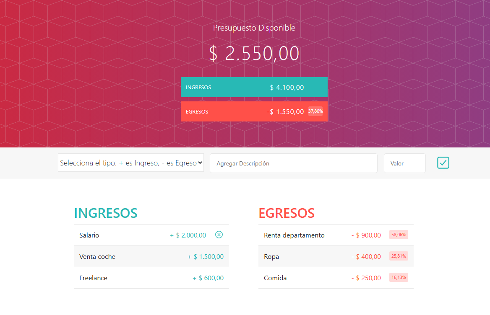

# Aplicación Presupuesto

Aplicación web para gestionar ingresos y egresos personales. Permite agregar, eliminar y visualizar el balance de tu presupuesto.

## Características

- Agregar y eliminar ingresos y egresos
- Visualización dinámica del presupuesto
- Formateo de moneda y porcentaje
- Interfaz sencilla y moderna

## Instalación

1. Clona el repositorio:
   ```
   git clone https://github.com/FrancoPortillo/aplicacion-presupuesto.git
   ```
2. Abre `index.html` en tu navegador.

## Demo



## Tecnologías

- HTML, CSS, JavaScript
- Bootstrap
- Ionicons

## Autor

Franco Javier Portillo Colinas 
